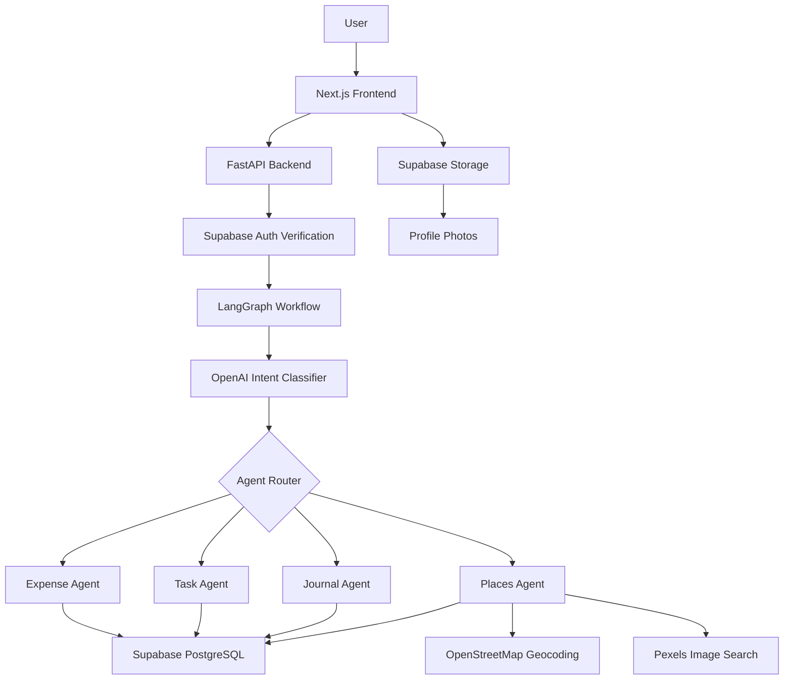

# LifeOS — AI-Powered Personal Assistant

LifeOS is a full-stack AI assistant that helps users manage expenses, tasks, journals, saved places, and profile settings using natural language. The app uses a LangGraph-based multi-agent workflow with OpenAI for intent routing and structured extraction.

---

## Project Overview

Users can type messages like:

```text
I spent $18 on lunch yesterday
Remind me to finish my resume by next Friday evening
Today was stressful but I made good progress on my AI project
I liked this restaurant called Desi District in Atlanta
```

LifeOS identifies the intent, routes the message to the correct agent, extracts structured information, and saves the result to the authenticated user's account.

---

## Key Features

- Supabase signup, login, protected pages, and user-specific data
- Strong password validation during signup
- Profile management with name, phone, birthdate, profile photo, password change, and delete account
- AI chat assistant with routing details and response cards
- Expense tracking with debit, credit, category, date filters, edit, and delete
- Task tracking with priority, due dates, reminders, completion, and filters
- Journal entries with AI-generated mood, tags, and summary
- Saved places with AI extraction, Pexels images, OpenStreetMap geocoding, distance calculation, nearby checks, and suggestions
- Personalized dashboard with profile photo, welcome message, money summary, tasks, and reminders
- Responsive desktop sidebar and mobile bottom navigation

---

## Tech Stack

### Frontend

- Next.js
- React
- TypeScript
- Tailwind CSS
- Supabase Auth Client
- Supabase Storage
- Browser Geolocation API

### Backend

- FastAPI
- Python
- Pydantic
- LangGraph
- OpenAI Python SDK
- Supabase Python Client
- HTTPX
- Dateparser

### Database / Auth / Storage

- Supabase PostgreSQL
- Supabase Auth
- Supabase Storage

### External APIs

- OpenAI API
- Pexels API
- OpenStreetMap Nominatim

---

## Architecture Diagram



---

## AI / LangGraph Workflow

```text
User message
↓
FastAPI /api/chat
↓
Supabase token verification
↓
LangGraph workflow
↓
OpenAI intent classifier
↓
Conditional router
↓
Selected agent
↓
OpenAI structured extraction
↓
Supabase persistence
↓
Formatted response
↓
Frontend response card
```

Agents:

```text
Orchestrator Agent
├── Expense Agent
├── Task Agent
├── Journal Agent
├── Places Agent
└── General Response Node
```

---

## Project Structure

```text
lifeos-ai-assistant/
├── backend/
│   ├── app/
│   │   ├── agents/
│   │   ├── graphs/
│   │   ├── services/
│   │   ├── main.py
│   │   └── schemas.py
│   ├── requirements.txt
│   └── .env.example
│
├── frontend/
│   ├── app/
│   │   ├── login/
│   │   ├── chat/
│   │   ├── expenses/
│   │   ├── tasks/
│   │   ├── journal/
│   │   ├── places/
│   │   ├── settings/
│   │   └── page.tsx
│   ├── components/
│   ├── lib/
│   └── public/
│
└── README.md
```

---

## Environment Variables

### Backend `.env`

```env
SUPABASE_URL=
SUPABASE_KEY=
SUPABASE_SERVICE_ROLE_KEY=
OPENAI_API_KEY=
OPENAI_MODEL=gpt-4o-mini
USE_LLM_ORCHESTRATOR=true
PEXELS_API_KEY=
```

### Frontend `.env.local`

```env
NEXT_PUBLIC_SUPABASE_URL=
NEXT_PUBLIC_SUPABASE_ANON_KEY=
NEXT_PUBLIC_BACKEND_URL=http://127.0.0.1:8000
```

---

## Setup Instructions

### Backend

```bash
cd backend
python -m venv .venv

# Windows
.venv\Scripts\activate

# Mac/Linux
source .venv/bin/activate

pip install -r requirements.txt
uvicorn app.main:app --reload
```

Backend runs at:

```text
http://127.0.0.1:8000
```

API docs:

```text
http://127.0.0.1:8000/docs
```

### Frontend

```bash
cd frontend
npm install
npm run dev
```

Frontend runs at:

```text
http://localhost:3000
```

---

## Supabase Setup

Create a Supabase project and configure:

- Auth: Email/password provider
- Database tables:
  - profiles
  - expenses
  - tasks
  - journal_entries
  - places
- Storage bucket:
  - profile-photos

For local development, email confirmation can be disabled to avoid email rate limits. For production, configure custom SMTP.

---

## Screenshots

Add screenshots later inside:

```text
frontend/public/screenshots/
```

Suggested screenshots:

```text
login.png
dashboard.png
chat.png
expenses.png
tasks.png
journal.png
places.png
settings.png
mobile-view.png
```

Example markdown:

```md

```

---

## Deployment Notes

### Backend

Recommended platforms:

- Render
- Railway
- Fly.io

Production command:

```bash
uvicorn app.main:app --host 0.0.0.0 --port $PORT
```

Required backend environment variables:

```env
SUPABASE_URL=
SUPABASE_KEY=
SUPABASE_SERVICE_ROLE_KEY=
OPENAI_API_KEY=
OPENAI_MODEL=gpt-4o-mini
USE_LLM_ORCHESTRATOR=true
PEXELS_API_KEY=
```

### Frontend

Recommended platform:

- Vercel

Required frontend environment variables:

```env
NEXT_PUBLIC_SUPABASE_URL=
NEXT_PUBLIC_SUPABASE_ANON_KEY=
NEXT_PUBLIC_BACKEND_URL=
```

`NEXT_PUBLIC_BACKEND_URL` should point to the deployed backend URL.

---

## Future Improvements

- Deploy frontend and backend
- Add custom SMTP for production auth emails
- Add push notifications and email reminders
- Add recurring expenses and recurring tasks
- Add budget alerts and expense charts
- Add journal mood analytics
- Add map visualization for saved places
- Add Google Calendar integration
- Add voice input
- Add automated weekly summaries
- Add test suite and CI/CD pipeline

---

## Portfolio Summary

LifeOS is a LangGraph-powered multi-agent personal AI assistant built with Next.js, FastAPI, Supabase, OpenAI, and LangGraph. It supports authenticated multi-user workflows, natural language task and expense logging, AI-generated journal summaries, location-aware saved places, profile management, and responsive UI.
